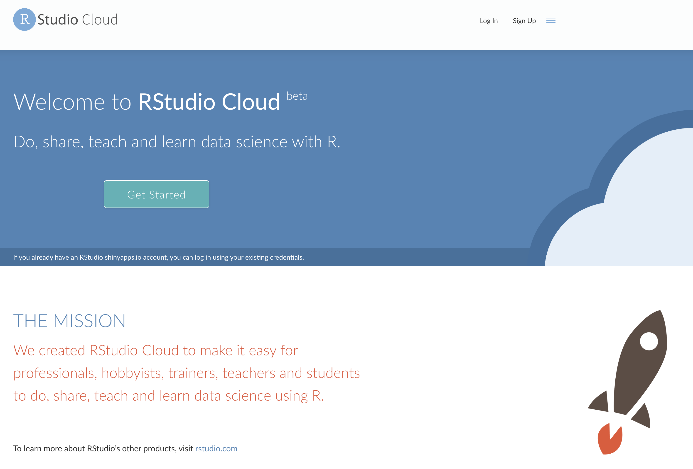

# Lesson 2

Review: Quantitative Geography Using R: Spatial data science for geographers. No quizzes or exams. Weekly assignments are due at 5p on Friday (your weekends are free)

Come prepared to work on your computer, laptop, or iPad. Monday and Wednesday I will present new material. Friday you will work on the assignment. Working together is encouraged. Assignments are made available in RStudio Cloud Thursday night or early Friday morning.

* Grades are solely determined by how well you do on the assignments. 
* Late classwork or homework assignments will not be accepted. 
* Cumulative numerical averages of 90 - 100 (outstanding) are guaranteed at least an A-, 80 - 89 (good) at least a B-, and 70 - 79 (satisfactory) at least a C-, however the exact ranges for letter grades will be determined after all work is complete.
* Class attendance is expected but not required.

* Much of the material for the course is in the online book: R for Data Science https://r4ds.had.co.nz/
* Help is available with material comes in https://tinystats.github.io/teacups-giraffes-and-statistics/index.html

## Navigating RStudio Cloud



Do this now:

- Login to RStudio Cloud. 
- Use the sandwich menu to see `Your Workspace` and `Spatial Data Analysis`. Select `Spatial Data Analysis`. This is the course workspace. 
- Click on the project `02_Lesson`. This creates a Temporary Project. Or you can click on the `+ Copy` button.
- Change the `author` on line 3 to your name (in quotes).
- Use the `Knit` button to create an HTML document.
- On the scroll down menu next to the `Knit` button, create a PDF or Word document.

Do this later:

- Repeat for the projects `00_Syllabus` and `01_Lesson`.

When you click the `knit` button at the top of an R Markdown file (like this one), R Markdown generates a polished copy of your report. R Markdown:

1. Transforms all of your text into actual formatted text (e.g. bold text, italic text, etc.)
2. Reruns all of your code chunks in a clean R session and appends the results to the finished report.
3. Saves the finished report alongside your .Rmd file

## Today

- Components of data science: reproducibility, communication, and automation
- R as a language
- Visualize your data


## Data Analysis

Data analysis must be done on a computer. You have two choices: use a spreadsheet or write code. 

A spreadsheet is convenient. But there are three conditions essential for a good data analysis: _reproducibility_, _communication_, and _automation_ that are difficult to achieve with a spreadsheet.

### Reproducibility

If your analysis is to be convincing, the trail from the data you started with to the final output must be available to the public. It is difficult to create a reproducible trail with a spreadsheet. It is easy to make mistakes (e.g., accidentally sorting just a column rather than the entire table).

A scientific paper is advertisement for a claim. But the _proof_ is the procedure that was used to obtain the result. The code is the exact procedure.

### Communication

Code is the recipe for what you did. It is the most efficient way to communicate precisely what was done. Communication to others and to your future self.

It's hard to explain to someone precisely what you did when working with a spreadsheet. Click here, then right click here, then choose menu X, etc. The words you might use to describe these procedures are not standard. Code is an efficient way to communicate because all important information is given as plain text without ambiguity.

### Automation

If you've ever made a map using a geographic information system (GIS) you know how hard it is to make another (even similar one) with a new set of data. Running code with new data is simple.

Being able to code is now a key skill for most technical jobs. In this course you will learn how to code using R. Keep in mind: Just like learning to write doesn't make you a writer, learning to code doesn't mean you will be a coder.

## The R programming language

* R is one of the leading open source programming language for data science. R and Python.
* R is free, open-source, runs on Windows, Macs, etc. Excellent graphing capabilities. Powerful, extensible, and relatively easy to learn syntax. Thousands of functions.
* R has all the cutting edge statistical methods including methods in spatial statistics.
* R is increasingly used by scientists of all stripes. Most of the world's statisticians use (and contribute to) it.

## Course Outline

We start with making graphs. You will make pretty and informative plots that help you understand data. You will learn the basic structure of a **ggplot2** plot. The syntax makes it easy to turn data into plots.

Visualization alone is not enough, so you will also learn the key verbs that allow you to select important variables, filter out key observations, create new variables, and compute summaries (data wrangling).

You will then combine data wrangling and visualization with your curiosity (and skepticism) to ask and answer interesting questions.

Towards the end of the semester we will look at some simple data models that extend your ability to ask and answer questions.

## Work in plain text, using R Markdown

The ability to reproduce your work in this way is important to a scientific process. It is also pragmatic. The person most likely to reproduce your work a few months later is you.

This is especially true for graphs and figures. These often have a finished quality to them as a result of tweaking and adjustments to the details. This makes it hard to reproduce later. 

The goal is to do as much of this tweaking as possible with the code we write, rather than in a way that is invisible (retrospectively). Contrast editing an image in Adobe Illustrator.

You will find yourself constantly going back and forth between three things:

(1) Writing code: You will write code to produce plots. You will also write code to load your data (get your data into R), to look quickly at tables of that data. Sometimes you will want to summarize, rearrange, subset, or augment your data, or fit a statistical model to it. You will want to be able to write that code as easily and effectively as possible.

(2) Looking at output. Your code is a set of instructions that produces the output you want: a table, a model, or a figure. It is helpful to be able to see that output.

(3) Taking notes. You will also write about what you are doing, and what your results mean.

To do these things efficiently you want to write your code _together_ with comments. This is where R Markdown comes in (files that end with `.Rmd`)

An R Markdown file is a plain text document where text (such as notes or discussion) is interspersed with pieces, or chunks, of R code. When you `Knit` this file the R code is executed piece by piece, in sequence, and either supplementing or replacing the chunks of code with output. 

The resulting file is then converted into a more easily-readable document formatted in HTML, PDF, or Word. The non-code segments of the document are plain text, but they can have simple formatting instructions in them. These are set using Markdown, a set of conventions for marking up plain text in a way that indicates how it should be formatted. When you create a markdown document in R Studio, it contains some sample text to get you started.

R Markdown treats text surrounded by *asterisks*, **double asterisks**, and `backticks` in special ways. It is R Markdown's way of saying that these words are in

- _italics_
- *also italics*
- **bold**, and
- `code font`

`*`, `**`, and \` are signals used by a text editing format known as `markdown`. R Markdown uses `markdown` to turn your plain looking .Rmd documents into polished reports.

Your notes or text, with Markdown formatting as needed, are interspersed with code. There is a set format for code chunks. They look like this:
```{r}

```

Three backticks (on a U.S. keyboard, the character under the escape key) followed by a pair of curly braces containing the name of the language we are using.The format is language-agnostic, and can be used with, e.g. Python and other languages. 

The backticks-and-braces part signal that a chunk of code is about to begin. You write your code as needed, and then end the chunk with a new line containing three more backticks.

If you keep your notes in this way, you will be able to see the code you wrote, the output it produces, and your own commentary or clarification on it in a convenient way. Moreover, you can turn it into a good-looking document right away.

This is how we will do everything in this course.

## Visualizing data

We begin with visualizing data. There are three essential things to learn:

1. How to create graphs with a reusable {ggplot2} template
2. How to add variables to a graph with aesthetics
3. How to select the 'type' of your graph with _geoms_

The following examples are taken from R for Data Science by Hadley Wickham and Garrett Grolemund, published by O’Reilly Media, Inc., 2016, ISBN: 9781491910399. You can purchase the book at https://r4ds.had.co.nz/.

### A code template

Let's begin with a question to explore.

What do you think: Do cars with big engines use more fuel than cars with small engines?

* A: Cars with bigger engines use more fuel.
* B: Cars with bigger engines use less fuel.

You can test your answer with two things: the `mpg` data that comes in {ggplot2} and a plot. The `mpg` object contains observations collected on 38 models of cars by the US Environmental Protection Agency. Among the variables in `mpg` are:

* `displ`, a car’s engine size, in liters.
* `hwy`, a car’s fuel efficiency on the highway, in miles per gallon (mpg).

A car with a low fuel efficiency consumes more fuel than a car with a high fuel efficiency when they travel the same distance.

To see the `mpg` data frame, type `mpg` after you loaded the package using the `library()` function.
```{r}
library(ggplot2)
mpg
```

The code below uses functions from the {ggplot2} package to plot the relationship between `displ` and `hwy`.

Let’s look at the plot and then talk about the code itself. To see the plot, click on the little green triangle in the upper right corner of the gray shaded region.
```{r}
ggplot(data = mpg) + 
  geom_point(mapping = aes(x = displ, y = hwy))
```

The plot shows an inverse relationship between engine size (`displ`) and fuel efficiency (`hwy`). Points that have a large value of `displ` have a small value of `hwy` and vice versa.

In other words, cars with big engines use more fuel. If that was your hypothesis, you were right!

Now let’s look at how we made the plot.

### The code

Here's the code that we used to make the plot. Notice that it contains three functions: `ggplot()`, `geom_point()`, and `aes()`.
```{r, eval=FALSE}
ggplot(data = mpg) + 
  geom_point(mapping = aes(x = displ, y = hwy))
```

The first function, `ggplot()`, creates a coordinate system that you can add layers to. The first argument of `ggplot()` is the dataset to use in the graph.

By itself, `ggplot(data = mpg)` creates an empty graph, but it is not very interesting so I'm not going to show it here.

The function `geom_point()` adds a layer of points to the empty plot created by `ggplot()`. As a result, we get a scatterplot.

The function `geom_point()` takes a mapping argument, which defines which variables in your dataset are mapped to which axes in your graph. The mapping argument is always paired with the function `aes()`, which you use to gather together all of the mappings that you want to create.

Here, we want to map the `displ` variable to the x axis (horizontal axis) and the `hwy` variable to the y axis (vertical axis), so we add `x = displ` and `y = hwy` inside of `aes()` (and we separate them with a comma). Where will `ggplot()` look for these mapped variables? In the data frame that we passed to the  data argument, in this case, `mpg`.

* Knit to generate HTML. 
* Compare the HTML with the Rmd.
